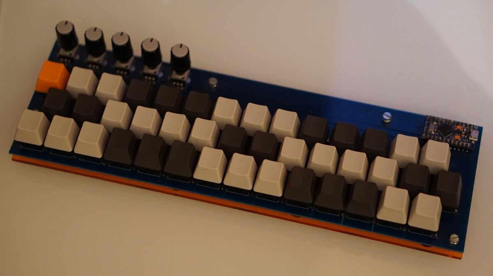

midi@3:14 is a home-made electronic keyboard for playing music.

It has been designed with the following requirements:

* Small size, light weight.
* Uniform layout.
* Compatible with any computer hardware (PC, Raspberry Pi, &hellip;) and free software synthesizers.

As a result, midi@3:14 has the following characteristics:

* [Jankó](https://en.wikipedia.org/wiki/Jank%C3%B3_keyboard) layout with 3 rows of 14 keys.
* 5 potentiometers that can be used to change the volume, or any other control value supported by the MIDI standard.
* A USB-MIDI interface.

This repository contains the Arduino sketches for the Pro Micro module.
