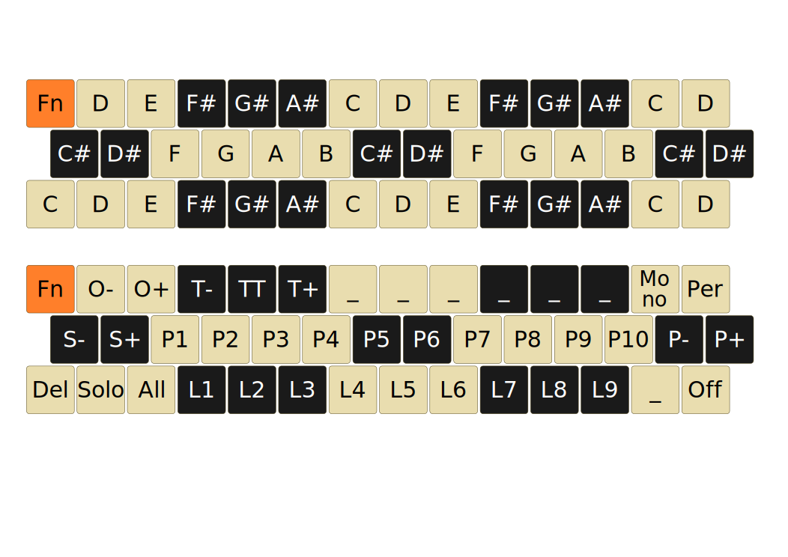

midi@3:14 is a home-made electronic keyboard for playing music.

It has been designed with the following requirements:

* Small size, light weight.
* Uniform layout.
* Compatible with any computer hardware (PC, Raspberry Pi, &hellip;) and free software synthesizers.

As a result, midi@3:14 has the following characteristics:

* [Jankó](https://en.wikipedia.org/wiki/Jank%C3%B3_keyboard) layout with 3 rows of 14 keys.
* 5 potentiometers that can be used to change the volume, or any other control value supported by the MIDI standard.
* A USB-MIDI interface.


This repository contains two Arduino sketches for the Pro Micro module:

* `midi314-keyboard`: the firmware of the MIDI keyboard.
* `midi314-joystick`: the firmware of an additional MIDI controller composed of a joystick and a pressure sensor to be used as a breath interface.

Keyboard layout
---------------

This figure shows the keymap of midi@3:14.



When the `Fn` key is released the other keys are used to play notes.
The top part of the figure corresponds to the initial note mapping, before any
pitch shift.

When the `Fn` key is pressed, the bottom part of the figure shows the special function
attached to each key.

| Abbreviation  | Function                                             |
|:--------------|:-----------------------------------------------------|
| `O-`          | Tune the keyboard one octave down.                   |
| `O+`          | Tune the keyboard one octave up.                     |
| `S-`          | Tune the keyboard one semitone down.                 |
| `S+`          | Tune the keyboard one semitone up.                   |
| `T-`          | Tempo down.                                          |
| `T+`          | Tempo up.                                            |
| `TT`          | Tap tempo.                                           |
| `P#`          | Instrument selection (MIDI Program Change).          |
| `P-`          | Previous 10 instruments.                             |
| `P+`          | Next 10 instruments.                                 |
| `Mono`        | Toggle monophonic/polyphonic mode                    |
| `Per`         | Toggle the percussion (channel 10) instrument mode   |
| `L#`          | Record, start, mute a loop.                          |
| `Del` + `L#`  | Delete a loop.                                       |
| `Solo` + `L#` | Mute all other loops and play the selected one only. |
| `All`         | Unmute all muted loops.                              |
| `Off`         | All notes off                                        |

While recording a loop, pressing `Fn` alone stops the recording and starts the loop.

Potentiometers have the following functions:

| Pot | Function       |
|:----|:---------------|
| 1   | Channel volume |
| 2   | Balance        |
| 3   | Reverb         |
| 4   | Chorus         |
| 5   | Modulation     |

MIDI events
-----------

The keyboard relies on several standard and custom MIDI events.
When the `Fn` key is released, the other keys trigger note-on and note-off events.

This table shows the Control-Change events that are currently supported:

| Identifier | Event                           |
|:-----------|:--------------------------------|
| 1          | Modulation                      |
| 2          | Breath                          |
| 7          | Channel volume                  |
| 10         | Pan                             |
| 11         | Expression                      |
| 91         | Reverb                          |
| 93         | Chorus                          |
| 123        | All notes off                   |
| 126        | Mono mode on                    |
| 127        | Poly mode on                    |
| 20         | Start recording a loop (custom) |
| 21         | Play a loop (custom)            |
| 22         | Mute a loop (custom)            |
| 23         | Delete a loop (custom)          |
| 24         | Mute all other loops (custom)   |
| 25         | Unmute all muted loops (custom) |
| 26         | Set min pitch (custom)          |
| 27         | Set min program (custom)        |
| 28         | Toggle percussion mode (custom) |

Build and upload instructions
-----------------------------

Using the Arduino CLI:

```
arduino-cli core install arduino:avr
arduino-cli compile --fqbn arduino:avr:leonardo --libraries libraries midi314-keyboard
arduino-cli upload --fqbn arduino:avr:leonardo --port /dev/ttyACM0 midi314-keyboard
```

Monitoring the MIDI port
------------------------

If your Linux distribution supports Pipewire, you can use `pw-link` to manage MIDI connections,
and `pw-mididump` to print the MIDI messages from the keyboard.

In a terminal, run:

```
pw-mididump
```

In another terminal, list the available MIDI output ports and locate the port name assigned to the Arduino module:

```
pw-link -o | grep Arduino
```

This command should print a port name like this: `Midi-Bridge:Arduino Leonardo:(capture_0) Arduino Leonardo MIDI 1`

List the available MIDI input ports and locate the port of `pw-mididump`.

```
pw-link -i | grep dump
```

You should get: `midi-dump:input`.

Connect the keyboard's MIDI port to `pw-mididump`:

```
pw-link "Midi-Bridge:Arduino Leonardo:(capture_0) Arduino Leonardo MIDI 1" "midi-dump:input"
```

Press the keys of the keyboard and turn the potentiometers.
Check that `pw-mididump` prints the MIDI messages from the keyboard.

Playing sound
-------------

We will run the synthesizer [FluidSynth](https://www.fluidsynth.org/) from the command line
with a custom MIDI port name like this:

```
fluidsynth -p FluidSynth
```

You can check the MIDI port name associated with FluidSynth by executing this command:

```
pw-link -i | grep FluidSynth
```

It should print `Midi-Bridge:FluidSynth:(playback_0) FluidSynth`.

Connect the keyboard's MIDI port to FluidSynth:

```
pw-link "Midi-Bridge:Arduino Leonardo:(capture_0) Arduino Leonardo MIDI 1" "Midi-Bridge:FluidSynth:(playback_0) FluidSynth"
```

... and play some notes.
